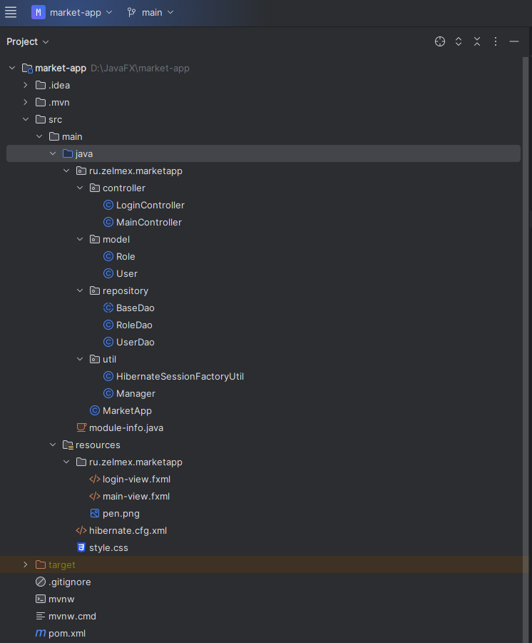

# Создание JavaFX+PostgreSQL приложения


[Скрипт базы данных `market`](FullScriptWithData.sql)
1. [Видеоурок 1: Создание БД](https://drive.google.com/file/d/14-NGQ6WPorWh_ekgKYMxOYuBLpejBfe_/view?usp=sharing)
2. [Видеоурок 2: Создание JavaFX приложения и создание login-view](https://drive.google.com/file/d/159GTm3YJtxWxvQBNWMc7HB0FRgJM7zZC/view?usp=sharing)

<details>

<summary>Программный код и ресурсы</summary>

`login-view.fxml`
```fxml
<?xml version="1.0" encoding="UTF-8"?>

<?import javafx.geometry.Insets?>
<?import javafx.scene.control.Button?>
<?import javafx.scene.control.Label?>
<?import javafx.scene.control.PasswordField?>
<?import javafx.scene.control.TextField?>
<?import javafx.scene.image.Image?>
<?import javafx.scene.image.ImageView?>
<?import javafx.scene.layout.AnchorPane?>
<?import javafx.scene.layout.ColumnConstraints?>
<?import javafx.scene.layout.GridPane?>
<?import javafx.scene.layout.RowConstraints?>

<AnchorPane maxHeight="-Infinity" maxWidth="-Infinity" minHeight="-Infinity" minWidth="-Infinity"
            prefHeight="170.0" prefWidth="300.0" styleClass="anchor-pane" xmlns="http://javafx.com/javafx/22"
            xmlns:fx="http://javafx.com/fxml/1" fx:controller="ru.zelmex.marketapp.controller.LoginController">
   <children>
      <GridPane layoutX="100.0" layoutY="118.0" styleClass="grid-pane" AnchorPane.bottomAnchor="0.0" AnchorPane.leftAnchor="0.0" AnchorPane.rightAnchor="0.0" AnchorPane.topAnchor="0.0">
        <columnConstraints>
          <ColumnConstraints hgrow="SOMETIMES" minWidth="10.0" prefWidth="100.0" />
          <ColumnConstraints hgrow="SOMETIMES" minWidth="10.0" prefWidth="100.0" />
        </columnConstraints>
        <rowConstraints>
          <RowConstraints minHeight="10.0" prefHeight="30.0" vgrow="SOMETIMES" />
          <RowConstraints minHeight="10.0" prefHeight="30.0" vgrow="SOMETIMES" />
            <RowConstraints minHeight="10.0" prefHeight="30.0" vgrow="SOMETIMES" />
          <RowConstraints minHeight="10.0" prefHeight="30.0" vgrow="SOMETIMES" />
        </rowConstraints>
         <children>
            <Label alignment="CENTER" maxHeight="1.7976931348623157E308" maxWidth="1.7976931348623157E308" styleClass="header-label" text="MARKET" GridPane.columnSpan="2" GridPane.halignment="CENTER" GridPane.valignment="CENTER" />
            <TextField fx:id="textFiedUsername" promptText="Введите логин" GridPane.columnSpan="2" GridPane.rowIndex="1">
               <GridPane.margin>
                  <Insets left="5.0" right="5.0" />
               </GridPane.margin>
            </TextField>
            <PasswordField fx:id="passwordField" promptText="Введите пароль" GridPane.columnSpan="2" GridPane.rowIndex="2">
               <GridPane.margin>
                  <Insets left="5.0" right="5.0" />
               </GridPane.margin>
            </PasswordField>
            <Button fx:id="btnOK" maxHeight="1.7976931348623157E308" maxWidth="1.7976931348623157E308" mnemonicParsing="false" onAction="#btnOkOnAction" text="OK" GridPane.rowIndex="3">
               <GridPane.margin>
                  <Insets bottom="5.0" left="5.0" right="5.0" top="5.0" />
               </GridPane.margin>
            </Button>
            <Button fx:id="btnCancel" maxHeight="1.7976931348623157E308" maxWidth="1.7976931348623157E308" mnemonicParsing="false" onAction="#btnCancelOnAction" text="Cancel" GridPane.columnIndex="1" GridPane.rowIndex="3">
               <GridPane.margin>
                  <Insets bottom="5.0" left="5.0" right="5.0" top="5.0" />
               </GridPane.margin>
            </Button>
            <ImageView fitHeight="30.0" fitWidth="30.0" pickOnBounds="true" preserveRatio="true">
               <GridPane.margin>
                  <Insets left="20.0" />
               </GridPane.margin>
               <image>
                  <Image url="@pen.png" />
               </image>
            </ImageView>
         </children>
      </GridPane>
   </children>
</AnchorPane>

```
`LoginController.java`
```java
package ru.zelmex.marketapp.controller;

import javafx.event.ActionEvent;
import javafx.fxml.FXML;
import javafx.scene.control.Button;
import javafx.scene.control.PasswordField;
import javafx.scene.control.TextField;

public class LoginController {

    @FXML
    private Button btnCancel;

    @FXML
    private Button btnOK;

    @FXML
    private PasswordField passwordField;

    @FXML
    private TextField textFiedUsername;

    @FXML
    void btnCancelOnAction(ActionEvent event) {

    }

    @FXML
    void btnOkOnAction(ActionEvent event) {

    }

}

```
</details>

3. [Видеоурок 3: Добавление CSS стилей и картинок](https://drive.google.com/file/d/1DA_coMMWPL5ZeAi6BR6TfnbP6GinxkvX/view?usp=sharing)

<details>
<summary>Программный код и ресурсы</summary>


`style.css`
```css
.root {
     -fx-main-bg-color: #FFF;
     -fx-additional-bg-color: #17E9E0;
     -fx-accent-bg-color: #FCCD04;
     -fx-headers-color: #A64AC9;
     -fx-fields-color:  #F5E6CC;
 }

.grid-pane {
     -fx-background-color: -fx-main-bg-color;
}

.label
{
  -fx-font-weight: bold;
  -fx-font-size: 14px;
  -fx-background-color: transparent;
}

.header-label
{
    -fx-font-size: 26px;
    -fx-font-weight: bold;
    -fx-background-color: transparent;
    -fx-text-fill: -fx-headers-color;
}

.button {

  -fx-border-style: solid; /* Green */
  -fx-border-color: -fx-additional-bg-color;
  -fx-background-color: -fx-additional-bg-color;
  -fx-padding: 5 5;
  -fx-text-fill: -fx-main-bg-color;
  -fx-text-align: center;
  -fx-display: inline-block;
  -fx-font-size: 16px;
  -fx-font-weight: bold;
}

.button:hover {
  -fx-background-color: white;
  -fx-border-color: none;
  -fx-text-fill: #000000;
}

.text-field
{
    -fx-font-size: 10pt;
    -fx-background-color: -fx-fields-color;
    -fx-text-fill: black;
    -fx-font-weight: bold;
    -fx-border-style: solid; /* Green */
    -fx-border-width: 1px; /* Green */
    -fx-border-color: -fx-accent-bg-color;
}

```

`login-view.fxml`

```fxml
<?xml version="1.0" encoding="UTF-8"?>

<?import javafx.geometry.Insets?>
<?import javafx.scene.control.Button?>
<?import javafx.scene.control.Label?>
<?import javafx.scene.control.PasswordField?>
<?import javafx.scene.control.TextField?>
<?import javafx.scene.image.Image?>
<?import javafx.scene.image.ImageView?>
<?import javafx.scene.layout.AnchorPane?>
<?import javafx.scene.layout.ColumnConstraints?>
<?import javafx.scene.layout.GridPane?>
<?import javafx.scene.layout.RowConstraints?>

<AnchorPane maxHeight="-Infinity" maxWidth="-Infinity" minHeight="-Infinity" minWidth="-Infinity"
            prefHeight="170.0" prefWidth="300.0" styleClass="anchor-pane" xmlns="http://javafx.com/javafx/22"
            xmlns:fx="http://javafx.com/fxml/1" fx:controller="ru.zelmex.marketapp.controller.LoginController">
   <children>
      <GridPane layoutX="100.0" layoutY="118.0" styleClass="grid-pane" AnchorPane.bottomAnchor="0.0" AnchorPane.leftAnchor="0.0" AnchorPane.rightAnchor="0.0" AnchorPane.topAnchor="0.0">
        <columnConstraints>
          <ColumnConstraints hgrow="SOMETIMES" minWidth="10.0" prefWidth="100.0" />
          <ColumnConstraints hgrow="SOMETIMES" minWidth="10.0" prefWidth="100.0" />
        </columnConstraints>
        <rowConstraints>
          <RowConstraints minHeight="10.0" prefHeight="30.0" vgrow="SOMETIMES" />
          <RowConstraints minHeight="10.0" prefHeight="30.0" vgrow="SOMETIMES" />
            <RowConstraints minHeight="10.0" prefHeight="30.0" vgrow="SOMETIMES" />
          <RowConstraints minHeight="10.0" prefHeight="30.0" vgrow="SOMETIMES" />
        </rowConstraints>
         <children>
            <Label alignment="CENTER" maxHeight="1.7976931348623157E308" maxWidth="1.7976931348623157E308" styleClass="header-label" text="MARKET" GridPane.columnSpan="2" GridPane.halignment="CENTER" GridPane.valignment="CENTER" />
            <TextField fx:id="textFiedUsername" promptText="Введите логин" GridPane.columnSpan="2" GridPane.rowIndex="1">
               <GridPane.margin>
                  <Insets left="5.0" right="5.0" />
               </GridPane.margin>
            </TextField>
            <PasswordField fx:id="passwordField" promptText="Введите пароль" GridPane.columnSpan="2" GridPane.rowIndex="2">
               <GridPane.margin>
                  <Insets left="5.0" right="5.0" />
               </GridPane.margin>
            </PasswordField>
            <Button fx:id="btnOK" maxHeight="1.7976931348623157E308" maxWidth="1.7976931348623157E308" mnemonicParsing="false" onAction="#btnOkOnAction" text="OK" GridPane.rowIndex="3">
               <GridPane.margin>
                  <Insets bottom="5.0" left="5.0" right="5.0" top="5.0" />
               </GridPane.margin>
            </Button>
            <Button fx:id="btnCancel" maxHeight="1.7976931348623157E308" maxWidth="1.7976931348623157E308" mnemonicParsing="false" onAction="#btnCancelOnAction" text="Cancel" GridPane.columnIndex="1" GridPane.rowIndex="3">
               <GridPane.margin>
                  <Insets bottom="5.0" left="5.0" right="5.0" top="5.0" />
               </GridPane.margin>
            </Button>
            <ImageView fitHeight="30.0" fitWidth="30.0" pickOnBounds="true" preserveRatio="true">
               <GridPane.margin>
                  <Insets left="20.0" />
               </GridPane.margin>
               <image>
                  <Image url="@pen.png" />
               </image>
            </ImageView>
         </children>
      </GridPane>
   </children>
</AnchorPane>

```
`MarketApp.java`
```java
package ru.zelmex.marketapp;

import javafx.application.Application;
import javafx.fxml.FXMLLoader;
import javafx.scene.Scene;
import javafx.scene.image.Image;
import javafx.stage.Stage;

import java.io.IOException;

public class MarketApp extends Application {
    @Override
    public void start(Stage stage) throws IOException {
        FXMLLoader fxmlLoader = new FXMLLoader(MarketApp.class.getResource("login-view.fxml"));
        Scene scene = new Scene(fxmlLoader.load(), 300, 170);
        scene.getStylesheets().add("style.css");
        stage.getIcons().add(new Image(MarketApp.class.getResourceAsStream("pen.png")));
        stage.setResizable(false);
        stage.setTitle("Авторизация");
        stage.setScene(scene);
        stage.show();
    }

    public static void main(String[] args) {
        launch();
    }
}
```
</details>

4. [Видеоурок 4. Подключение к БД. Реализация авторизации в системе]

<details>

<summary>Программный код</summary>

## Структура проекта



### Файл `hibernate.cfg.xml`

<details>

<summary>hibernate.cfg.xml</summary>

```xml
<?xml version = "1.0" encoding = "utf-8"?>
<!DOCTYPE hibernate-configuration PUBLIC
        "-//Hibernate/Hibernate Configuration DTD 3.0//EN"
        "http://www.hibernate.org/dtd/hibernate-configuration-3.0.dtd">
<hibernate-configuration>
    <session-factory>
        <!-- Set URL -->
        <property name="hibernate.connection.url">jdbc:postgresql://192.168.2.202:5432/market</property>
        <!-- Set User Name -->
        <property name="hibernate.connection.username">postgres</property>
        <!-- Set Password -->
        <property name="hibernate.connection.password">root</property>
        <!-- Set Driver Name -->
        <property name="hibernate.connection.driver_class">org.postgresql.Driver</property>
        <property name="hibernate.current_session_context_class">thread</property>
        <property name="hibernate.show_sql">true</property>
        <!-- Optional: Auto-generate schema -->
        <!-- <property name = "hibernate.hbm2ddl.auto">create</property> -->
        <mapping class="ru.zelmex.marketapp.model.Role"/>
        <mapping class="ru.zelmex.marketapp.model.User"/>
    </session-factory>
</hibernate-configuration>

```
</details>

### Файлы интерфейсов 


<details>

<summary>login-view.fxml</summary>

```fxml
<?xml version="1.0" encoding="UTF-8"?>

<?import javafx.geometry.Insets?>
<?import javafx.scene.control.Button?>
<?import javafx.scene.control.Label?>
<?import javafx.scene.control.PasswordField?>
<?import javafx.scene.control.TextField?>
<?import javafx.scene.image.Image?>
<?import javafx.scene.image.ImageView?>
<?import javafx.scene.layout.AnchorPane?>
<?import javafx.scene.layout.ColumnConstraints?>
<?import javafx.scene.layout.GridPane?>
<?import javafx.scene.layout.RowConstraints?>

<AnchorPane maxHeight="-Infinity" maxWidth="-Infinity" minHeight="-Infinity" minWidth="-Infinity"
            prefHeight="170.0" prefWidth="300.0" styleClass="anchor-pane" xmlns="http://javafx.com/javafx/22"
            xmlns:fx="http://javafx.com/fxml/1" fx:controller="ru.zelmex.marketapp.controller.LoginController">
   <children>
      <GridPane layoutX="100.0" layoutY="118.0" styleClass="grid-pane" AnchorPane.bottomAnchor="0.0" AnchorPane.leftAnchor="0.0" AnchorPane.rightAnchor="0.0" AnchorPane.topAnchor="0.0">
        <columnConstraints>
          <ColumnConstraints hgrow="SOMETIMES" minWidth="10.0" prefWidth="100.0" />
          <ColumnConstraints hgrow="SOMETIMES" minWidth="10.0" prefWidth="100.0" />
        </columnConstraints>
        <rowConstraints>
          <RowConstraints minHeight="10.0" prefHeight="30.0" vgrow="SOMETIMES" />
          <RowConstraints minHeight="10.0" prefHeight="30.0" vgrow="SOMETIMES" />
            <RowConstraints minHeight="10.0" prefHeight="30.0" vgrow="SOMETIMES" />
          <RowConstraints minHeight="10.0" prefHeight="30.0" vgrow="SOMETIMES" />
        </rowConstraints>
         <children>
            <Label alignment="CENTER" maxHeight="1.7976931348623157E308" maxWidth="1.7976931348623157E308" styleClass="header-label" text="MARKET" GridPane.columnSpan="2" GridPane.halignment="CENTER" GridPane.valignment="CENTER" />
            <TextField fx:id="textFieldUsername" promptText="Введите логин" GridPane.columnSpan="2" GridPane.rowIndex="1">
               <GridPane.margin>
                  <Insets left="5.0" right="5.0" />
               </GridPane.margin>
            </TextField>
            <PasswordField fx:id="passwordField" promptText="Введите пароль" GridPane.columnSpan="2" GridPane.rowIndex="2">
               <GridPane.margin>
                  <Insets left="5.0" right="5.0" />
               </GridPane.margin>
            </PasswordField>
            <Button fx:id="btnOK" maxHeight="1.7976931348623157E308" maxWidth="1.7976931348623157E308" mnemonicParsing="false" onAction="#btnOkOnAction" text="OK" GridPane.rowIndex="3">
               <GridPane.margin>
                  <Insets bottom="5.0" left="5.0" right="5.0" top="5.0" />
               </GridPane.margin>
            </Button>
            <Button fx:id="btnCancel" maxHeight="1.7976931348623157E308" maxWidth="1.7976931348623157E308" mnemonicParsing="false" onAction="#btnCancelOnAction" text="Cancel" GridPane.columnIndex="1" GridPane.rowIndex="3">
               <GridPane.margin>
                  <Insets bottom="5.0" left="5.0" right="5.0" top="5.0" />
               </GridPane.margin>
            </Button>
            <ImageView fitHeight="30.0" fitWidth="30.0" pickOnBounds="true" preserveRatio="true">
               <GridPane.margin>
                  <Insets left="20.0" />
               </GridPane.margin>
               <image>
                  <Image url="@pen.png" />
               </image>
            </ImageView>
         </children>
      </GridPane>
   </children>
</AnchorPane>

```
</details>

<details>

<summary>main-view.fxml</summary>

```fxml
<?xml version="1.0" encoding="UTF-8"?>

<?import javafx.scene.control.Label?>
<?import javafx.scene.layout.AnchorPane?>


<AnchorPane maxHeight="-Infinity" maxWidth="-Infinity" minHeight="-Infinity" minWidth="-Infinity" prefHeight="400.0" prefWidth="600.0" xmlns="http://javafx.com/javafx/22" xmlns:fx="http://javafx.com/fxml/1" fx:controller="ru.zelmex.marketapp.controller.MainController">
   <children>
      <Label fx:id="labelUser" layoutX="34.0" layoutY="24.0" text="Label" />
   </children>
</AnchorPane>

```
</details>

### Класс `MarketApp`

<details>

<summary>MarketApp.java</summary>

```java
package ru.zelmex.marketapp;

import javafx.application.Application;
import javafx.stage.Stage;

import java.io.IOException;

import static ru.zelmex.marketapp.util.Manager.showStartStage;

public class MarketApp extends Application {
    @Override
    public void start(Stage stage) throws IOException {

        showStartStage(stage, "login-view.fxml", "Авторизация");
    }

    public static void main(String[] args) {
        launch();
    }
}
```
</details>

### Утилитарные классы в пакете util

<details>

<summary>HibernateSessionFactoryUtil.java</summary>

```java
package ru.zelmex.marketapp.util;

import org.hibernate.SessionFactory;

import org.hibernate.cfg.Configuration;

public class HibernateSessionFactoryUtil {
    private static SessionFactory sessionFactory;
    private HibernateSessionFactoryUtil(){}

    public static SessionFactory getSessionFactory()
    {
        if (sessionFactory == null)
        {
            try {
                Configuration configuration = new Configuration();
                configuration.configure("hibernate.cfg.xml");
                sessionFactory = configuration.buildSessionFactory();

            } catch (Exception e)
            {
                System.out.println("Исключение " + e);
            }

        }
        return sessionFactory;
    }
}

```

</details>

<details>

<summary>Manager.java</summary>

```java
package ru.zelmex.marketapp.util;

import javafx.application.Platform;
import javafx.fxml.FXMLLoader;
import javafx.scene.Scene;
import javafx.scene.control.Alert;
import javafx.scene.control.ButtonType;
import javafx.scene.image.Image;
import javafx.stage.Stage;
import ru.zelmex.marketapp.MarketApp;
import ru.zelmex.marketapp.model.User;

import java.io.IOException;
import java.util.Optional;

public class Manager {
    public static User currentUser = null;

    public static Stage startStage;
    public static Stage mainStage;
    public static Stage currentStage;

    public static boolean showExitWindow() {
        Alert alert = new Alert(Alert.AlertType.CONFIRMATION);
        alert.setTitle("Закрыть приложение");
        alert.setHeaderText("Вы действительно хотите выйти?");
        Optional<ButtonType> result = alert.showAndWait();
        return result.get() == ButtonType.OK;
    }

    public static void showErrorMessageBox(String error) {
        Alert alert = new Alert(Alert.AlertType.ERROR);
        alert.setTitle("Ошибка");
        alert.setHeaderText(error);
        alert.showAndWait();
    }


    public static void MessageBox(String title, String header, String message, Alert.AlertType alertType) {
        Alert alert = new Alert(alertType);
        alert.setTitle(title);
        alert.setHeaderText(header);
        alert.setContentText(message);
        alert.showAndWait();
    }

    public static Optional<ButtonType> ShowConfirmWindow() {
        Alert alert = new Alert(Alert.AlertType.CONFIRMATION);
        alert.setTitle("Удаление");
        alert.setHeaderText("Вы действительно хотите удалить запись?");
        alert.setContentText("Также будут удалены все зависимые записи");
        Optional<ButtonType> result = alert.showAndWait();
        return result;
    }

    public static void showStartStage(Stage stage, String fxmlFileName, String title) {
        try {
            stage.getIcons().add(new Image(MarketApp.class.getResourceAsStream("pen.png")));
            stage.setScene(createScene(fxmlFileName));
            stage.setTitle(title);
            stage.setResizable(false);
            stage.setOnCloseRequest(windowEvent -> {
                if (showExitWindow()) {
                    Platform.exit();
                }
                else {
                    windowEvent.consume();
                }
            });

            startStage = stage;
            stage.show();
        } catch (IOException e) {
            throw new RuntimeException(e);
        }
    }

    public static  Scene createScene(String fxmlFileName) throws IOException
    {
        FXMLLoader fxmlLoader = new FXMLLoader(MarketApp.class.getResource(fxmlFileName));
        Scene scene = new Scene(fxmlLoader.load());
        scene.getStylesheets().add("style.css");
        return scene;

    }

    public static void showMainStage(User person) {
        try {
            currentUser = person;
            mainStage = new Stage();
            mainStage.getIcons().add(new Image(MarketApp.class.getResourceAsStream("pen.png")));
            mainStage.setScene(createScene("main-view.fxml"));
            mainStage.setTitle("МАРКЕТ");
            mainStage.setMaximized(true);
            mainStage.setOnCloseRequest(windowEvent -> {
              startStage.show();
            });
            mainStage.show();
        } catch (IOException e) {
            throw new RuntimeException(e);
        }
    }
}

```

</details>

</details>
